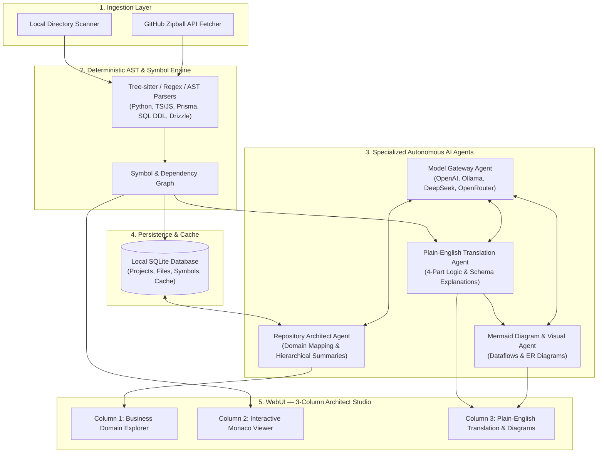
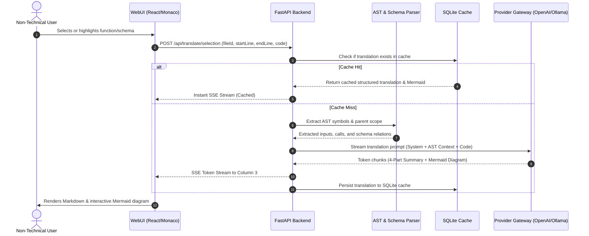

# CodeBridge V1 — Agent & Multi-Engine Architecture (`AGENTS.md`)

## 1. Overview & Architectural Philosophy

**CodeBridge V1** is an AI-powered code architecture interpreter and non-technical translation engine. Its mission is to ingest modern codebases (from local folders or remote GitHub repositories) and empower non-technical stakeholders—product managers, founders, operations leads, and business analysts—to understand files, logic flows, and database schemas in plain, human-friendly English without reading cryptic code syntax.

To achieve reliable, low-latency, and high-fidelity translations, CodeBridge operates on a **hybrid pipeline**:
1. **Deterministic AST & Structural Analysis**: Fast local parsers extract concrete code symbols (classes, functions, parameters, Prisma models, SQL tables, Drizzle schemas) without hallucination.
2. **Specialized AI Agents & Translation Engines**: Purpose-built LLM agents translate structural data into hierarchical business domains, plain-English summaries, and visual Mermaid.js flowcharts.
3. **Local SQLite Persistence**: Caches parse trees, domain maps, and generated translations to guarantee sub-second repeat queries and zero redundant LLM costs.



---

## 2. Multi-Agent Taxonomy & Responsibilities

CodeBridge organizes its intelligence into five distinct, cooperative agent roles:

```
+-----------------------------------------------------------------------------------+
|                              CODEBRIDGE AGENT SUITE                               |
+-------------------------+-------------------------+-------------------------------+
| Agent Name              | Primary Responsibility  | Key Input / Output            |
+-------------------------+-------------------------+-------------------------------+
| 1. Repository Architect | Bottom-up summarizer    | File tree -> Business domain  |
|    Agent                | & domain mapper         | taxonomy & project summary    |
+-------------------------+-------------------------+-------------------------------+
| 2. AST & Schema Parser  | Deterministic symbol    | Raw code files -> AST tokens, |
|    Engine               | & entity extraction     | functions, models, relations  |
+-------------------------+-------------------------+-------------------------------+
| 3. Plain-English        | User-selected code &    | Code snippet / AST -> 4-part  |
|    Translation Agent    | schema translator       | executive structured breakdown|
+-------------------------+-------------------------+-------------------------------+
| 4. Visual Diagram &     | Logic flow & ER         | Function calls / models ->    |
|    Journey Agent        | diagram generator       | Validated Mermaid.js markup   |
+-------------------------+-------------------------+-------------------------------+
| 5. Provider Gateway &   | Dynamic LLM routing     | Dynamic endpoints / models -> |
|    Orchestration Agent  | & streaming controller  | Server-Sent Events (SSE)      |
+-------------------------+-------------------------+-------------------------------+
```

---

### Agent 1: Repository Architect Agent (Domain Mapper & Summarizer)

* **Role Persona**: Senior Enterprise Architect who talks like a VP of Product. Translates directory structures into real-world business departments.
* **Core Responsibilities**:
  1. **Folder-to-Domain Mapping**: Scans folder names and directory hierarchies to map them to intuitive business domains.
     * `/src/api/v1/billing` -> *"Financial Transactions & Subscription Management"*
     * `/src/services/notifications` -> *"Customer Communication Pipeline (Email/SMS)"*
     * `/src/auth` -> *"Identity Verification & Access Control"*
  2. **Hierarchical Summarization (Bottom-Up)**:
     * **Level 1 (File Level)**: Generates 2-sentence non-technical summaries of each file's primary responsibility and external dependencies.
     * **Level 2 (Folder/Domain Level)**: Synthesizes file summaries into a unified business domain capability overview.
     * **Level 3 (Project Level)**: Produces an executive repository briefing explaining the entire product's architecture, key capabilities, and integration points.
* **Input**: Project file tree, file metadata, deterministic symbol counts.
* **Output**: Hierarchical business domain graph and executive briefing stored in SQLite and rendered in Column 1.

---

### Agent 2: AST & Schema Parser Engine (Deterministic Scanner)

* **Role Persona**: Fast, deterministic static analysis engine. Operates with zero hallucinations.
* **Core Responsibilities**:
  1. **Multi-Language Symbol Extraction**:
     * **TypeScript / JavaScript**: Extracts exported functions, interfaces, type aliases, classes, and async route handlers.
     * **Python**: Extracts functions, classes, decorators, Pydantic schemas, and FastAPI endpoints.
  2. **Database & Schema Ingestion**:
     * **Prisma (`schema.prisma`)**: Parses `model`, `enum`, field types, primary keys (`@id`), foreign key relations (`@relation`), and indexing directives.
     * **SQL DDL (`.sql` / migrations)**: Parses `CREATE TABLE`, column types, nullability, primary keys, foreign keys (`REFERENCES`), and unique constraints.
     * **TypeScript ORM (Drizzle / TypeORM)**: Extracts `pgTable()`, `mysqlTable()`, column definitions, and relational joins.
  3. **Code Boundary & Range Mapping**:
     * Maps line-and-column ranges for every symbol, enabling instantaneous symbol highlighting and range extraction in the Monaco editor.
* **Input**: Raw source code text.
* **Output**: JSON symbol manifest (`Symbol[]`, `SchemaModel[]`, `Relation[]`).

---

### Agent 3: Plain-English Translation Agent (Interactive Deep-Dive)

* **Role Persona**: Empathetic technical communicator who translates complex algorithms, database schemas, and business rules into plain English for non-engineers.
* **Core Responsibilities**:
  1. Translates highlighted code snippets, single functions, or complete models on-demand.
  2. Enforces the strict **CodeBridge 4-Part Structure**:
     * **1. The Plain-English Summary**: What this block of code or database table accomplishes in everyday language.
     * **2. Inputs & Parameters**: What data enters this component, explained using intuitive analogies (e.g., *"Takes the customer's email address and shopping cart total"* instead of *"Accepts `req.body.cartTotal: number`"*).
     * **3. Outputs & Side Effects**: What happens as a direct consequence (e.g., *"Creates a pending charge in Stripe and records the receipt in the customer's order history"*).
     * **4. Business Rule Tie-In**: Why this logic is crucial to the business operation, revenue generation, or security posture.
* **Input**: User-selected code range, surrounding AST context, project domain map.
* **Output**: Structured markdown response streamed via Server-Sent Events (SSE) into Column 3.

---

### Agent 4: Visual Diagram & Journey Agent (Mermaid Generator)

* **Role Persona**: Technical visualization designer specializing in Mermaid.js syntax.
* **Core Responsibilities**:
  1. **Data Journey Flowcharts**: Generates Mermaid `flowchart TD` or `sequenceDiagram` for highlighted logic blocks, illustrating how data flows from user input -> validation -> business logic -> database storage -> external APIs.
  2. **Schema Entity-Relationship (ER) Diagrams**: Generates Mermaid `erDiagram` for database models (Prisma, SQL, Drizzle), showing entity relationships (1-to-1, 1-to-many, many-to-many) with clear human labels.
  3. **Syntax Validation & Sanitization**: Strips invalid characters, escapes parentheses and quotes in node labels, and ensures diagrams render without syntax errors in the WebUI.
* **Input**: AST symbol graph, function call graph, schema entity definitions.
* **Output**: Clean, validated Mermaid markdown blocks embedded seamlessly into translation cards.

---

### Agent 5: Provider Gateway & Orchestration Agent (Dynamic LLM Backend)

* **Role Persona**: Resilient API client and model abstraction manager.
* **Core Responsibilities**:
  1. **OpenAI-Compatible Universal Adapter**: Dynamically connects to:
     * **Local Ollama** (`http://localhost:11434/v1`)
     * **LM Studio** (`http://localhost:1234/v1`)
     * **DeepSeek API** (`https://api.deepseek.com/v1`)
     * **OpenRouter** (`https://openrouter.ai/api/v1`)
     * **Official OpenAI** (`https://api.openai.com/v1`)
  2. **Dynamic Configuration Management**:
     * Reads Base URL, API Key, Model Name, and Temperature from SQLite settings without requiring application restarts.
     * Provides a `/api/settings/test-connection` endpoint to verify endpoint latency and model availability.
  3. **Token Conservation & Prompt Caching**:
     * Injects only the relevant AST symbol definitions and domain context into prompts, preventing context exhaustion on large repositories.
     * Streams tokens in real time via FastAPI `StreamingResponse` for snappy UI feedback.
* **Input**: Outgoing prompt, system message, user configuration.
* **Output**: Asynchronous token stream yielding SSE events (`data: {"chunk": "..."}`).

---

## 3. Inter-Agent Communication Protocol

The agents communicate through a structured event and data contract orchestrated by FastAPI endpoints:



---

## 4. Prompt Engineering & System Personas

### Translation System Prompt Specification

Every translation request sent to Agent 3 utilizes the following standardized prompt template:

```markdown
You are CodeBridge Translator, an expert AI software architect who translates complex code and database schemas into crystal-clear business English for product managers, executives, and non-technical stakeholders.

### Core Rules:
1. NEVER output raw walls of uncommented code. Non-engineers should not need to decipher code syntax.
2. Translate jargon into tangible everyday concepts (e.g., instead of "mutates state via dispatch", say "updates the customer's live dashboard with their new balance").
3. Always format your explanation in the standard 4-part CodeBridge structure:
   - ### 1. Plain-English Summary
   - ### 2. Inputs & Parameters (What goes in)
   - ### 3. Outputs & Side Effects (What happens)
   - ### 4. Business Rule Tie-In (Why this matters)
4. If the code or schema involves multiple steps or database relationships, include a valid Mermaid.js diagram (`flowchart TD` or `erDiagram`) enclosed in a ```mermaid code fence. Always quote node names with special characters.
```

---

## 5. Security, Local Privacy & Guardrails

1. **Local-First Privacy**:
   - Ingestion, file storage, AST parsing, and SQLite caching run entirely on the user's local machine.
   - When configured with a local provider (Ollama or LM Studio), zero code or token data ever leaves the local environment.
2. **Safe GitHub Ingestion**:
   - Only repository source archives (zipballs) are retrieved via GitHub REST API over HTTPS.
   - Files are extracted into a sandboxed cache folder with path-traversal safeguards (`os.path.commonpath` verification).
   - Sensitive files (`.env`, `.pem`, credentials) are automatically excluded from indexing and LLM prompt context.
3. **No Unassisted Code Walls**:
   - The UI always renders human explanations as primary content; source code is visually subordinated in the center Monaco viewer with line-number linking.
