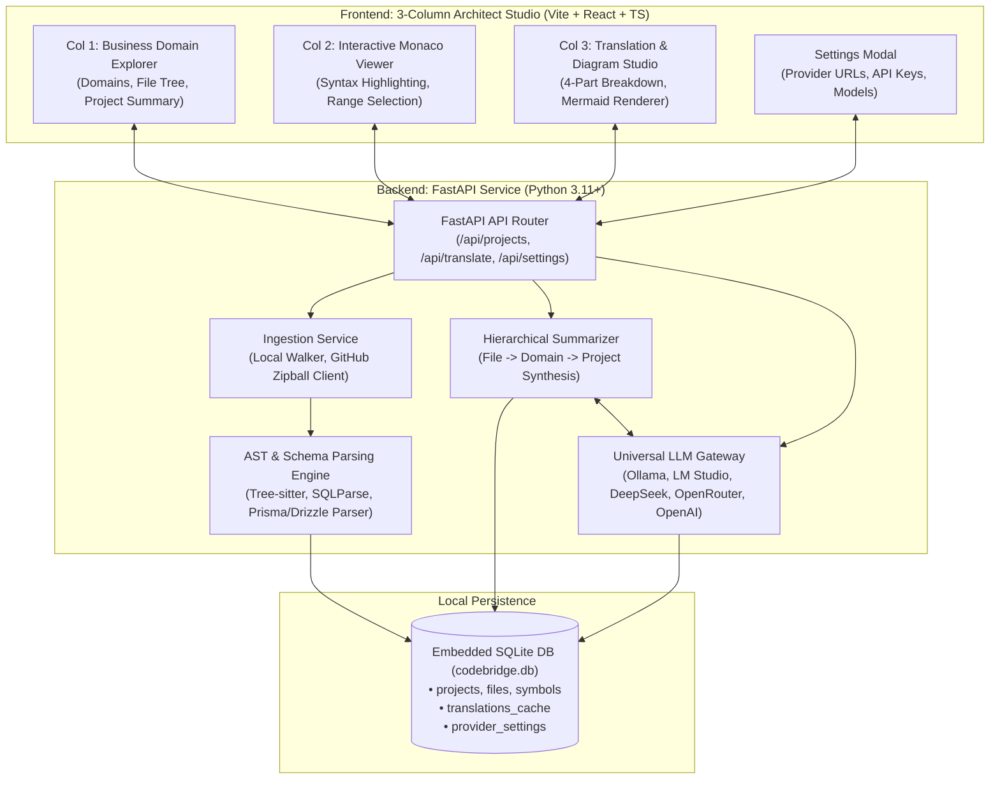
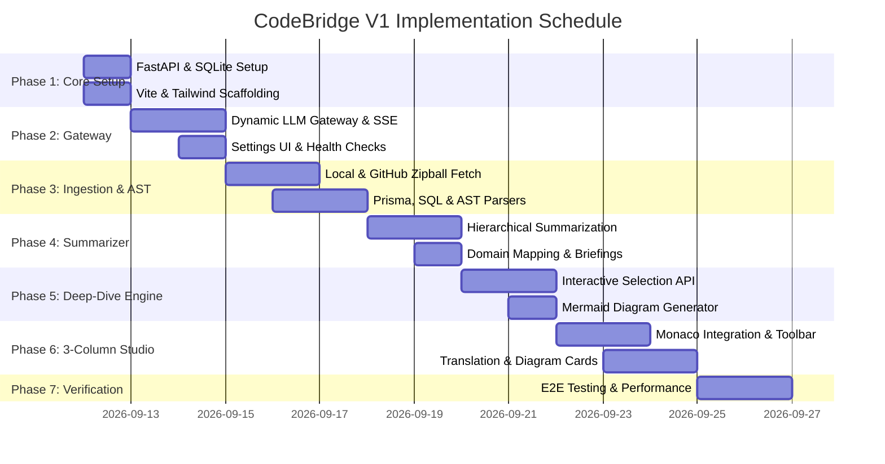

# CodeBridge V1 — Comprehensive Development Plan (`DEVELOPMENT-PLAN.md`)

## 1. Executive Summary & Vision

**CodeBridge V1** is an AI-powered code architecture interpreter and non-technical translation engine designed for local WebUI execution. Its core objective is to dismantle the communication barrier between engineering teams and non-technical stakeholders (Product Managers, Founders, Operations, and Business Analysts).

By combining **deterministic Abstract Syntax Tree (AST) parsing** with **hierarchical LLM translation** and **interactive visual diagrams**, CodeBridge transforms opaque code repositories and complex database schemas into plain-English business narratives and interactive architecture maps.

---

## 2. Technical Stack & Architecture

Based on the architectural choices finalized in the project brief:

| Layer | Technology | Rationale |
| :--- | :--- | :--- |
| **Backend Framework** | **Python 3.11+ / FastAPI / Uvicorn** | High-performance async API with native streaming (SSE), ideal for tree-sitter AST parsing and LLM orchestration. |
| **AST & Schema Parsers** | **Tree-sitter**, **SQLParse**, **Pydantic v2**, custom Prisma/Drizzle grammars | Deterministic extraction of functions, models, fields, and relations with zero AI hallucination. |
| **LLM Gateway** | **HTTPX Async Client / OpenAI-Compatible SDK** | Dynamic routing to local Ollama (`localhost:11434`), LM Studio, DeepSeek, OpenRouter, or official OpenAI. |
| **Persistence & Cache** | **SQLite (WAL Mode via `aiosqlite`)** | Local-first zero-config embedded storage for projects, symbols, translations, and user settings. |
| **Frontend Framework** | **React 18 / Vite / TypeScript** | Ultra-fast local development, strictly typed component contracts, and lightweight bundle footprint. |
| **Styling & Components** | **Tailwind CSS + Lucide Icons** | Modern, accessible, executive-grade UI with responsive dark/light mode support. |
| **Code & Schema Viewer**| **Monaco Editor (`@monaco-editor/react`)** | VS Code-grade code inspection, line-range selection, syntax highlighting, and custom context actions. |
| **Visual Diagrams** | **Mermaid.js (`mermaid`)** | Client-side dynamic rendering of execution flowcharts and Entity-Relationship (ER) database diagrams. |
| **State Management** | **Zustand + TanStack Query v5** | Lightweight client state for active selections and robust cache invalidation for API queries. |

---

## 3. System Architecture Diagram



---

## 4. Repository Directory Blueprint

```
codebridge/
├── AGENTS.md                          # Multi-agent roles, specifications, and prompt guardrails
├── DEVELOPMENT-PLAN.md                # Comprehensive engineering implementation plan
├── README.md                          # Project documentation and quickstart guide
├── package.json                       # Root script orchestrator (concurrently run backend + frontend)
├── backend/
│   ├── pyproject.toml                 # Poetry / Hatchling / pip requirements
│   ├── requirements.txt               # Direct pip dependencies
│   ├── run.py                         # FastAPI local server entrypoint
│   ├── app/
│   │   ├── __init__.py
│   │   ├── main.py                    # FastAPI application initialization & CORS
│   │   ├── config.py                  # App configuration & environment defaults
│   │   ├── db/
│   │   │   ├── __init__.py
│   │   │   ├── database.py            # SQLite connection & table initialization
│   │   │   └── models.py              # SQLite schemas (projects, files, symbols, cache, settings)
│   │   ├── parsers/
│   │   │   ├── __init__.py
│   │   │   ├── base.py                # Base parser interface
│   │   │   ├── ts_js_parser.py        # TypeScript / JavaScript AST extractor
│   │   │   ├── python_parser.py       # Python AST symbol extractor
│   │   │   ├── prisma_parser.py       # Prisma schema (schema.prisma) parser
│   │   │   ├── sql_parser.py          # SQL DDL / migrations parser (CREATE TABLE, FKs)
│   │   │   └── drizzle_parser.py      # Drizzle / TypeORM model extractor
│   │   ├── services/
│   │   │   ├── __init__.py
│   │   │   ├── ingestion_service.py   # Local directory scanner & GitHub Zipball fetcher
│   │   │   ├── summarizer_service.py  # Bottom-up hierarchical summarizer
│   │   │   ├── translation_service.py # 4-part code and schema translation generator
│   │   │   ├── diagram_service.py     # Mermaid.js flowchart & ER diagram generator
│   │   │   └── llm_gateway.py         # OpenAI-compatible streaming client
│   │   └── api/
│   │       ├── __init__.py
│   │       ├── routes_projects.py     # Ingest repo, list projects, fetch file tree
│   │       ├── routes_files.py        # Read file content, list symbols
│   │       ├── routes_translate.py    # SSE stream for highlight & schema translation
│   │       └── routes_settings.py     # Provider configuration & connection health check
│   └── tests/
│       ├── test_parsers.py            # Unit tests for AST and schema parsers
│       ├── test_ingestion.py          # Local and GitHub zipball ingestion tests
│       └── test_llm_gateway.py        # Mocked streaming and provider tests
└── frontend/
    ├── package.json
    ├── tsconfig.json
    ├── vite.config.ts
    ├── index.html
    └── src/
        ├── main.tsx                   # React root entry
        ├── App.tsx                    # Main 3-Column Architect Studio layout
        ├── index.css                  # Tailwind styles & theme variables
        ├── types/
        │   ├── project.ts             # Domain, file, and symbol types
        │   ├── translation.ts         # 4-part translation & Mermaid types
        │   └── settings.ts            # Provider configuration types
        ├── stores/
        │   ├── useProjectStore.ts     # Active project, selected file, highlighted range
        │   ├── useTranslationStore.ts # Streaming translation chunks, active tab
        │   └── useSettingsStore.ts    # Model provider, base URL, API key state
        ├── components/
        │   ├── layout/
        │   │   ├── Header.tsx         # Project switcher, settings button, repo ingestion CTA
        │   │   └── StudioLayout.tsx   # Resizable 3-column container
        │   ├── explorer/
        │   │   ├── DomainNavigator.tsx# Column 1: Business domain groupings
        │   │   ├── FileTree.tsx       # Column 1: Collapsible directory tree
        │   │   └── ProjectSummary.tsx # Column 1: High-level executive overview modal/card
        │   ├── editor/
        │   │   ├── MonacoViewer.tsx   # Column 2: Code viewer with line numbers
        │   │   ├── SelectionToolbar.tsx# Floating action button: "Translate in Plain English"
        │   │   └── SchemaViewer.tsx   # Specialized column 2 view for database schemas
        │   ├── translation/
        │   │   ├── TranslationPanel.tsx # Column 3: 4-part structured breakdown
        │   │   ├── MermaidCard.tsx    # Column 3: Interactive Mermaid diagram renderer
        │   │   ├── ImpactBadge.tsx    # Visual badge for business domain impact
        │   │   └── PlainEnglishChat.tsx # Follow-up Q&A for non-technical users
        │   └── settings/
        │       └── SettingsDialog.tsx # Provider configuration & connection test UI
        └── lib/
            ├── api.ts                 # Axios / Fetch client wrappers
            └── mermaid.ts             # Mermaid initialization and SVG sanitizer
```

---

## 5. Database Schema Specification (Embedded SQLite)

```sql
-- Project metadata
CREATE TABLE IF NOT EXISTS projects (
    id TEXT PRIMARY KEY,
    name TEXT NOT NULL,
    source_type TEXT NOT NULL, -- 'local' or 'github'
    source_path TEXT NOT NULL,
    executive_summary TEXT,
    created_at TIMESTAMP DEFAULT CURRENT_TIMESTAMP,
    updated_at TIMESTAMP DEFAULT CURRENT_TIMESTAMP
);

-- Ingested file index
CREATE TABLE IF NOT EXISTS files (
    id TEXT PRIMARY KEY,
    project_id TEXT NOT NULL,
    relative_path TEXT NOT NULL,
    file_type TEXT NOT NULL, -- 'code', 'schema', 'config', 'doc'
    language TEXT NOT NULL,  -- 'typescript', 'python', 'prisma', 'sql', etc.
    size_bytes INTEGER NOT NULL,
    plain_summary TEXT,      -- 2-sentence non-technical file summary
    business_domain TEXT,    -- e.g., "Payment Processing", "User Authentication"
    FOREIGN KEY(project_id) REFERENCES projects(id) ON DELETE CASCADE
);

-- Extracted deterministic symbols
CREATE TABLE IF NOT EXISTS symbols (
    id TEXT PRIMARY KEY,
    file_id TEXT NOT NULL,
    name TEXT NOT NULL,
    symbol_type TEXT NOT NULL, -- 'function', 'class', 'model', 'table', 'endpoint'
    start_line INTEGER NOT NULL,
    end_line INTEGER NOT NULL,
    signature TEXT,
    parameters_json TEXT,      -- Raw parameter list for AST inspection
    FOREIGN KEY(file_id) REFERENCES files(id) ON DELETE CASCADE
);

-- Cached LLM translations (avoids re-computation)
CREATE TABLE IF NOT EXISTS translations_cache (
    id TEXT PRIMARY KEY,
    cache_key TEXT UNIQUE NOT NULL, -- SHA256(code_snippet + prompt_version + model)
    summary_text TEXT NOT NULL,
    inputs_text TEXT NOT NULL,
    outputs_text TEXT NOT NULL,
    business_rule_text TEXT NOT NULL,
    mermaid_code TEXT,
    created_at TIMESTAMP DEFAULT CURRENT_TIMESTAMP
);

-- Dynamic Provider Settings
CREATE TABLE IF NOT EXISTS provider_settings (
    id TEXT PRIMARY KEY DEFAULT 'active_config',
    provider_type TEXT NOT NULL, -- 'ollama', 'lmstudio', 'deepseek', 'openrouter', 'openai'
    base_url TEXT NOT NULL,
    api_key TEXT,
    model_name TEXT NOT NULL,
    temperature REAL DEFAULT 0.2,
    updated_at TIMESTAMP DEFAULT CURRENT_TIMESTAMP
);
```

---

## 6. Phased Implementation Roadmap



---

### Phase 1: Project Scaffolding & Core Architecture Setup
* **Objectives**: Create clean dual-process architecture (`/backend` and `/frontend`) with seamless local run commands.
* **Backend Tasks**:
  * Set up FastAPI with CORS middleware allowing the Vite dev port (`http://localhost:5173`).
  * Implement `aiosqlite` database initializer creating the 5 core tables.
  * Implement default provider seed data (pointing to local Ollama with fallback to OpenAI format).
* **Frontend Tasks**:
  * Initialize Vite with React + TypeScript, Tailwind CSS, and Lucide Icons.
  * Configure unified root `package.json` with npm scripts:
    * `npm run dev:backend`
    * `npm run dev:frontend`
    * `npm run dev` (runs both concurrently).
* **Deliverable**: Backend runs on `http://127.0.0.1:8000`, frontend runs on `http://localhost:5173`, connected via health-check endpoint.

---

### Phase 2: Dynamic OpenAI-Compatible Provider Gateway
* **Objectives**: Allow seamless hot-switching between Local Ollama, LM Studio, DeepSeek, OpenRouter, and OpenAI.
* **Tasks**:
  * Build `LLMGateway` service using `httpx.AsyncClient` supporting both standard completion and SSE streaming.
  * Implement `POST /api/settings` and `GET /api/settings` for storing and retrieving provider settings in SQLite.
  * Implement `POST /api/settings/test-connection`: Sends a lightweight token ping (`"test"`) and reports latency in milliseconds.
  * Create frontend `SettingsDialog.tsx` with quick-select presets:
    * **Ollama**: `http://localhost:11434/v1`, Model: `llama3.2` or `mistral`
    * **LM Studio**: `http://localhost:1234/v1`, Model: `local-model`
    * **DeepSeek**: `https://api.deepseek.com/v1`, Model: `deepseek-chat`
    * **OpenRouter**: `https://openrouter.ai/api/v1`, Model: `meta-llama/llama-3.1-70b-instruct`
    * **OpenAI**: `https://api.openai.com/v1`, Model: `gpt-4o-mini`
* **Deliverable**: Settings panel successfully verifies connections and switches models without restarting the server.

---

### Phase 3: Repository Ingestion & Deterministic AST Engine
* **Objectives**: Ingest repositories from local directories or GitHub zipball archives without Git CLI dependencies; parse symbols deterministically.
* **Tasks**:
  * **Local Ingestion**: Implement file crawler filtering `.gitignore`, `node_modules`, `.git`, `dist`, `__pycache__`, and binaries (`.png`, `.wasm`, etc.).
  * **GitHub Zipball Fetcher**:
    * Implement `POST /api/projects/github`: Downloads `https://api.github.com/repos/{owner}/{repo}/zipball/{branch}` using stream unzip to local cache.
    * Supports optional GitHub Personal Access Token (PAT) for private repositories and higher rate limits.
  * **AST & Schema Parsers**:
    * **Prisma Parser (`schema.prisma`)**: Extracts all models, fields, types, `@id`, and `@relation` links.
    * **SQL Parser (`.sql`)**: Uses `sqlparse` to extract `CREATE TABLE`, column names, primary keys, and foreign keys.
    * **TypeScript/JavaScript Parser**: Extracts exported functions, interfaces, and routes with exact start/end line numbers.
    * **Python Parser**: Uses Python's native `ast` module to extract classes, methods, docstrings, and FastAPI decorators.
* **Deliverable**: Repositories ingested into SQLite with complete symbol catalogs and line mappings.

---

### Phase 4: Hierarchical Summarization Engine
* **Objectives**: Generate plain-English explanations hierarchically from bottom to top.
* **Tasks**:
  * **Level 1 (File Level)**: Analyze file symbols and imports to produce a 2-sentence executive summary of the file's business role.
  * **Level 2 (Business Domain Mapping)**: Group folders into high-level business capabilities:
    * `/src/routes/checkout` -> *"Customer Checkout & Order Creation"*
    * `/prisma/schema.prisma` -> *"Core Database Schema & Data Models"*
    * `/src/integrations/twilio` -> *"SMS & Multi-Factor Notification Gateway"*
  * **Level 3 (Project Level)**: Synthesize domain summaries into an executive project brief explaining architecture, user personas, and data storage.
  * Cache all generated summaries in SQLite to avoid re-prompting.
* **Deliverable**: Column 1 displays intuitive business domains instead of raw, cryptic file trees.

---

### Phase 5: Interactive Code & Schema Translation Engine (Highlight Deep-Dive)
* **Objectives**: Enable real-time, user-selected translation of any code snippet or database schema into the 4-part CodeBridge format.
* **Tasks**:
  * Implement `POST /api/translate/stream` accepting `{ file_id, start_line, end_line, selected_code }`.
  * Inject surrounding AST context (parent function, class, or schema relations) into the prompt.
  * Enforce strict 4-part structured output:
    1. **Plain-English Summary**
    2. **Inputs & Parameters**
    3. **Outputs & Effects**
    4. **Business Rule Tie-in**
  * **Mermaid Generator**:
    * If logic flow: generate `flowchart TD` tracing the data journey.
    * If schema selection: generate `erDiagram` showing tables and relationships.
  * Stream response via Server-Sent Events (SSE) with SHA-256 caching in `translations_cache`.
* **Deliverable**: Sub-second cached response or real-time streaming translation with interactive visual diagrams.

---

### Phase 6: Frontend 3-Column Architect Studio
* **Objectives**: Build an executive-grade, responsive WebUI tailored for non-technical users.
* **Column Breakdown**:
  * **Column 1 (Left: Business Domain & File Explorer)**:
    * High-level Executive Briefing card with domain accordion.
    * Tree view with badges showing business domains and file summaries on hover.
  * **Column 2 (Center: Interactive Monaco Code & Schema Viewer)**:
    * Full Monaco editor with syntax highlighting in read-only inspection mode.
    * Floating selection popover: User highlights any lines -> popover appears with *"Translate in Plain English"*.
    * Line-click shortcuts for instant function/model selection.
  * **Column 3 (Right: Translation & Diagram Studio)**:
    * Card view with the 4-part structured breakdown.
    * Embedded dynamic Mermaid.js diagram with SVG zoom/pan controls.
    * "Plain-English Q&A" chat box for asking follow-up questions about the selected code block.
* **Deliverable**: Complete end-to-end interactive 3-column studio.

---

### Phase 7: End-to-End Verification, Testing & Polish
* **Objectives**: Validate accuracy, fault tolerance, and performance.
* **Tasks**:
  * **Automated Test Suite**:
    * `backend/tests/test_parsers.py`: Verify Prisma, SQL, and TS symbol extraction against sample fixtures.
    * `backend/tests/test_llm_gateway.py`: Test fallback handling when an endpoint is unreachable.
    * `backend/tests/test_ingestion.py`: Test zipball extraction and directory sanitization.
  * **Sample Test Fixtures**:
    * E-commerce app with Prisma schema, Stripe webhook, and authentication middleware.
  * **UI / UX Polish**:
    * Loading skeletons during ingestion and streaming.
    * Error boundaries and toast notifications for invalid endpoints or missing API keys.
* **Deliverable**: Robust, tested V1 release ready for local deployment.

---

## 7. Verification & Success Criteria

1. **Deterministic Accuracy**:
   - 100% of Prisma models and SQL `CREATE TABLE` statements must parse without error.
   - Exact start/end line bounds for functions match Monaco editor line selections.
2. **Translation Quality**:
   - Zero raw code blocks in the summary tab.
   - All explanations strictly follow the 4-part structure (Summary, Inputs, Outputs, Business Rule).
3. **Provider Flexibility**:
   - Switching from Local Ollama to OpenAI or DeepSeek occurs dynamically without restarting the FastAPI server.
4. **Performance Benchmark**:
   - File AST parsing completes under 50ms per file.
   - Repeated translations for identical selections return instantly (<10ms) from SQLite cache.
